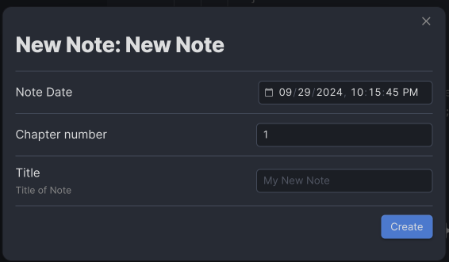

# Note From Form

[Obsidian](https://obsidian.md/) plugin that allows to define form with different type of input fields and JavaScript support that will later be used together with template to generate notes.

It behaves same as Templates Core plugin or [From Template](https://github.com/mo-seph/obsidian-note-from-template) but extend it functionality with strongly typed fields, allow initial values and support user defined JavaScript functions for value generations. 


Consider having template like this

```text
---
tags: tag1, tag2
aliases: alias1
date: {{date}}
note-from-form: {
	"file-name": "t:My Note {{noteNum}}",
	"file-location": "f:function(view){ return 'My Folder'; }",
	"form-items": [
		{
			"id": "date",
			"type": "dateTime",
			"get": "t:yyyy-MM-DDTHH:mm:ss",
			"form": {
				"title": "Note Date"
			}
		},
		{
			"id": "chapterNum",
			"type": "number",
			"init": "v:1",
			"form": {
				"title": "Chapter number"
			}
		},
		{
			"id": "title",
			"type": "text",
			"form": {
				"title": "Title",
				"description": "Title of Note",
				"placeholder": "My New Note"
			}
		},
		{
			"id": "noteNum",
			"type": "number",
			"get": "f:function (view) { return moment(view.date).format('x'); }"
		}
	]
}
---

# Chapter {{chapterNum}}: {{title}}
```

After adding template to the index and call for template, following form will be displayed:



And will generate following Markdown and add it to the note named `My Note 1727640827748` where `1727640827748` is Unix timestamp of `Note Date` field. Note will be created in directory named `My Folder`.

```markdown
---
tags: tag1, tag2
aliases: alias1
date: 2024-09-29T22:13:47

---

# Chapter 1: This is title
```

## Template Description

Form and note template are defined as markdown files that supports [mustache](https://mustache.github.io/) syntax for values that need to be placed from form. Instructions for form itself are defined as [JSON](https://www.json.org/json-en.html) object inside [properties](https://help.obsidian.md/Editing+and+formatting/Properties). Property name might be defined in plugin settings or be a default value `note-from-form`.

Form template contains following fields:
- `file-name` used to define name of the result file;
- `file-location` used to define folder where new note will be stored;
- `form-items` used to define content of the input form or compute values for template based on the input or user-defined logic.

### `file-name`

Used to specify name of the file for new note.

This property should be initialized with following format `<type>:<value>`. `type` specifies outcome of the value and might be one of the following:
- `v`. In this case content after `:` will be used as result/ For example `v:My File`;
- `t`. In this case post-processed input form will be used as source for [mustache](https://mustache.github.io/) template passed after `:`. For example, `t:My Note {{noteNum}}`;
- `f`. In this case user defined JavaScript function can be specified. Function accepts only one parameter that is object constructed from all fields defined in `form-items` after calling `get` function (see bellow) for each of them. This might be used in case if result should be computed based on some complex logic not supported by mustache templates. For example, `f:function(view) { return "My Value" + moment(Date.now()).format(); }`

`file-name` is optional and if not defined, textbox with input for new file name will be displayed on input form.

### `file-location`

Used to specify location of file with new note in Obsidian vault. 

This property should be initialized with following format `<type>:<value>`. `type` specifies outcome of the value and might be one of the following:
- `v`. In this case content after `:` will be used as result/ For example `v:My File`;
- `t`. In this case post-processed input form will be used as source for [mustache](https://mustache.github.io/) template passed after `:`. For example, `t:My Note {{noteNum}}`;
- `f`. In this case user defined JavaScript function can be specified. Function accepts only one parameter that is object constructed from all fields defined in `form-items` after calling `get` function (see bellow) for each of them. This might be used in case if result should be computed based on some complex logic not supported by mustache templates. For example, `f:function(view) { return "My Value" + moment(Date.now()).format(); }`

`file-location` is optional and if not defined value specified in plugin settings would be used. In case if plugin settings are missing it, textbox for input will be displayed on input form.

### `form-items`

Is array of items that are defining structure and content of input form and used as source for generating object that will be later used by plugin as source for **mustache** blocks inside template.

Each item of array may have following structure:
```json
{
	"id": "filed Id",
	"type": "field type",
	"init": "init funtion",
	"get": "get function",
	"form": {
		"title": "title of field on form",
		"placeholder": "for text filed shows some placeholder",
		"description": "descrition of the filed on form"
	}
}
```

| Field Name | Is Mandatory | Description | Possible values |
|-|-|-|-|
| `id` | yes | Declare identifier of the filed in form. By this identifier field can be later referenced inside user defined function or mustache template | string with field name, i.e. `date` |
| `type` | yes | Specify type of input field. Type of the field allow you to control what user can input, what operations can be done and how field would be displayed | `text`, `textArea`, `date`, `time`, `dateTime`, `number` |
| `init` | no | Init function. Used to get initial value of field. In case if not specified, default value would be used | Pure values or user defined functions (see below) |
| `get` | no | This is function that is called after all input provided and used to create result object that will be used as source of values for template, `file-name` and `file-location` | Pure value, mustache template or user defined function |
| `form` | no | Instructs plugin how to render field on form. This property might be skipped if some computed values are needed but shouldn't be changed by user | Complex object that have `title`, `placeholder` and `description` fields |
| `title` | no | Used to provide user-friendly name of the field. | Any string |
| `placeholder` | no | For fields of `text` and `textArea` types might be used as filed placeholder. For other types is not used | Any string |
| `description` | no | Used to provide user-friendly description of the field on input form | Any string |