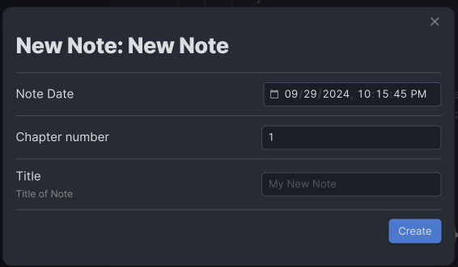
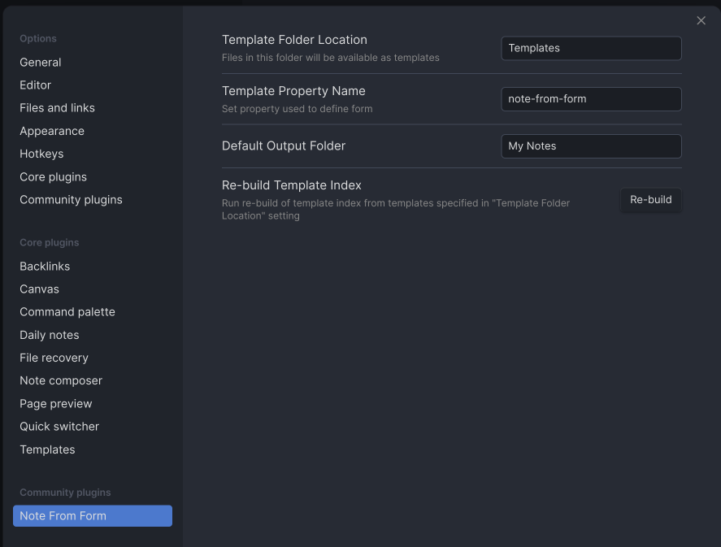
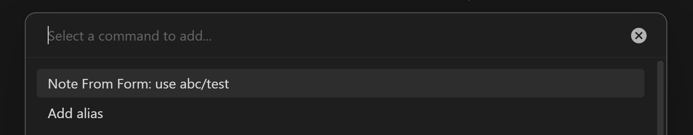
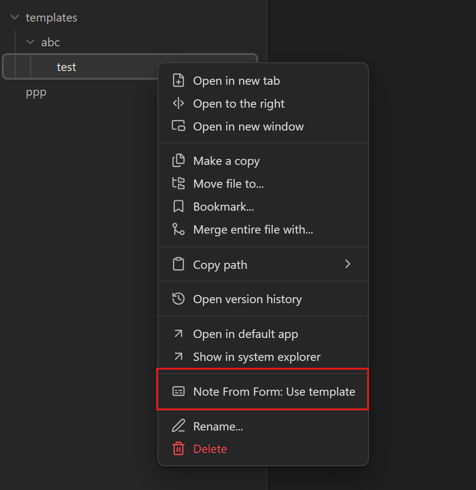

# Note From Form

> **⚠️ Breaking Changes in v2.0**
> Version 2.0 introduces breaking changes that are not backward compatible with previous versions. Templates created for v1.x may need to be updated. Please review the updated documentation below before upgrading.

[Obsidian](https://obsidian.md/) plugin that allows to define form with different type of input fields and JavaScript support that will later be used together with template to generate notes.

It behaves same as Templates Core plugin or [From Template](https://github.com/mo-seph/obsidian-note-from-template) but extends its functionality with strongly typed fields, allows initial values and supports user defined JavaScript functions for value generations. 

> [!INFO]
> Template can be described in both YAML (just [like note properties](https://obsidian.md/help/properties#Property+format) in Obsidian) or JSON.


Consider having template like one of those

| YAML | JSON |
|-|-|
| <pre lang="yaml">---<br>tags: tag1, tag2<br>aliases: alias1<br>date: "{{date}}"<br>note-from-form:<br>  file-name: "t:My Note {{noteNum}}"<br>  file-location: "f:function(view){ return 'My Folder'; }"<br>  form-items:<br>    - id: date<br>      type: dateTime<br>      get: "t:yyyy-MM-DDTHH:mm:ss"<br>      form:<br>        title: Note Date<br>    - id: chapterNum<br>      type: number<br>      init: "v:1"<br>      form:<br>        title: Chapter number<br>    - id: title<br>      type: text<br>      form:<br>        title: Title<br>        description: Title of Note<br>        placeholder: My New Note<br>    - id: done<br>      type: checkbox<br>      form:<br>        title: Mark as done<br>    - id: category<br>      type: dropdown<br>      init: 'v:[{"k":"work","v":"Work"},{"k":"personal","v":"Personal"}]'<br>      form:<br>        title: Category<br>    - id: noteNum<br>      type: number<br>      get: "f:function (view) { return moment(view.date).format('x'); }"<br>---<br><br># Chapter {{chapterNum}}: {{title}}<br><br>Done: {{done}}<br>Category: {{category}}</pre> | <pre lang="yaml">---<br>tags: tag1, tag2<br>aliases: alias1<br>date: "{{date}}"<br>note-from-form: \|-<br>  {<br>    "file-name": "t:My Note {{noteNum}}",<br>    "file-location": "f:function(view){ return 'My Folder'; }",<br>    "form-items": [<br>      {<br>        "id": "date",<br>        "type": "dateTime",<br>        "get": "t:yyyy-MM-DDTHH:mm:ss",<br>        "form": {<br>          "title": "Note Date"<br>        }<br>      },<br>      {<br>        "id": "chapterNum",<br>        "type": "number",<br>        "init": "v:1",<br>        "form": {<br>          "title": "Chapter number"<br>        }<br>      },<br>      {<br>        "id": "title",<br>        "type": "text",<br>        "form": {<br>          "title": "Title",<br>          "description": "Title of Note",<br>          "placeholder": "My New Note"<br>        }<br>      },<br>      {<br>        "id": "done",<br>        "type": "checkbox",<br>        "form": {<br>          "title": "Mark as done"<br>        }<br>      },<br>      {<br>        "id": "category",<br>        "type": "dropdown",<br>        "init": "v:[{\"k\":\"work\",\"v\":\"Work\"},{\"k\":\"personal\",\"v\":\"Personal\"}]",<br>        "form": {<br>          "title": "Category"<br>        }<br>      },<br>      {<br>        "id": "noteNum",<br>        "type": "number",<br>        "get": "f:function (view) { return moment(view.date).format('x'); }"<br>      }<br>    ]<br>  }<br>---<br><br># Chapter {{chapterNum}}: {{title}}<br><br>Done: {{done}}<br>Category: {{category}}</pre> |

After adding template to the index and call for template, following form will be displayed:



And will generate following Markdown and add it to the note named `My Note 1727640827748` where `1727640827748` is Unix timestamp of `Note Date` field. Note will be created in directory named `My Folder`.

```markdown
---
tags: tag1, tag2
aliases: alias1
date: 2024-09-29T22:13:47

---

# Chapter 1: This is title

Done: false
Category: Work
```

## Using
1. Install plugin
2. Open plugin settings and set location of template files. Also you can specify obsidian property that will point to template definition:

3. Create set of templates that will be used by plugin to generate input form and new notes. See [Template Description](#template-description);


If template files have no issues Obsidian command palette will be enriched with new commands in format `Note From Form: path/to/template`, and context menu option will appear for template file. Use commands from command palette to create new note from template:

| Use template from commands | Use template from context menu |
|-|-|
|  |  |


## Template Description

Form and note template are defined as markdown files that supports [mustache](https://mustache.github.io/) syntax for values that need to be placed from form. Instructions for form itself are defined as [JSON](https://www.json.org/json-en.html) or [YAML](https://yaml.org/) object inside [properties](https://help.obsidian.md/Editing+and+formatting/Properties). Property name might be defined in plugin settings or be a default value `note-from-form`.

Form template contains following fields:
- [`file-name`](#file-name) used to define name of the result file;
- [`file-location`](#file-location) used to define folder where new note will be stored;
- [`form-items`](#form-items) used to define content of the input form or compute values for template based on the input or user-defined logic.

### `file-name`

Used to specify name of the file for new note.

This property should be initialized with following format `<type>:<value>`. `type` specifies outcome of the value and might be one of the following:
- `v`. In this case content after `:` will be used as result. For example `v:My File`;
- `t`. In this case post-processed input form will be used as source for [mustache](https://mustache.github.io/) template passed after `:`. For example, `t:My Note {{noteNum}}`;
- `f`. In this case user defined JavaScript function can be specified. Function accepts only one parameter that is object constructed from all fields defined in `form-items` after calling `get` function (see below) for each of them. This might be used in case if result should be computed based on some complex logic not supported by mustache templates. For example, `f:function(view) { return "My Value" + moment(Date.now()).format(); }`

`file-name` is optional and if not defined, textbox with input for new file name will be displayed on input form.

### `file-location`

Used to specify location of file with new note in Obsidian vault. 

This property should be initialized with following format `<type>:<value>`. `type` specifies outcome of the value and might be one of the following:
- `v`. In this case content after `:` will be used as result. For example `v:/My Folder`;
- `t`. In this case post-processed input form will be used as source for [mustache](https://mustache.github.io/) template passed after `:`. For example, `t:My Note {{noteNum}}`;
- `f`. In this case user defined JavaScript function can be specified. Function accepts only one parameter that is object constructed from all fields defined in `form-items` after calling `get` function (see below) for each of them. This might be used in case if result should be computed based on some complex logic not supported by mustache templates. For example, `f:function(view) { return "My Value" + moment(Date.now()).format(); }`

`file-location` is optional and if not defined value specified in plugin settings would be used. In case if plugin settings are missing it, textbox for input will be displayed on input form.

### `form-items`

Is array of items that are defining structure and content of input form and used as source for generating object that will be later used by plugin as source for **mustache** blocks inside template.

Each item of array may have following structure:

| YAML | JSON |
|-|-|
| <pre lang="yaml">id: field Id<br>type: field type<br>init: init function<br>get: get function<br>form:<br>  title: title of field on form<br>  placeholder: for text field shows some placeholder<br>  description: description of the field on form</pre> | <pre lang="json">{<br>  "id": "field Id",<br>  "type": "field type",<br>  "init": "init function",<br>  "get": "get function",<br>  "form": {<br>    "title": "title of field on form",<br>    "placeholder": "for text field shows some placeholder",<br>    "description": "description of the field on form"<br>  }<br>}</pre> |

| Field Name | Is Mandatory | Description | Possible values |
|-|-|-|-|
| `id` | yes | Declare identifier of the field in form. By this identifier field can be later referenced inside user defined function or mustache template | string with field name, i.e. `date` |
| `type` | yes | Specify [type of input field](#input-type-fields). Type of the field allow you to control what user can input, what operations can be done and how field would be displayed | `text`, `textArea`, `date`, `time`, `dateTime`, `number`, `checkbox`, `dropdown` |
| `init` | no | [Init function](#init-function). Used to get initial value of field. In case if not specified, default value would be used | Pure values or user defined functions (see below) |
| `get` | no | This is [function](#get-function) that is called after all input provided and used to create result object that will be used as source of values for template, `file-name` and `file-location` | Pure value, mustache template or user defined function |
| `form` | no | Instructs plugin how to render field on form. This property might be skipped if some computed values are needed but shouldn't be changed by user | Complex object that have `title`, `placeholder` and `description` fields |
| `title` | no | Used to provide user-friendly name of the field. | Any string |
| `placeholder` | no | For fields of `text` and `textArea` types might be used as field placeholder. For other types is not used | Any string |
| `description` | no | Used to provide user-friendly description of the field on input form | Any string |

### `get` function
`get` function used to get final result of input and generate model used as source for template `mustache` blocks. It might be defined in one of three variants:

- `v:<value>`. This instructs `get` function to return string value defined after `:`. For example, `v:Hello World!` will return `Hello World!` string and assign it to appropriate field in model used in mustache blocks of template;
- `t:<mustache string>`. This instructs `get` function to collect all values defined in [`form-items`](#form-items) and use it as source for mustache template defined in `<mustache string>`. For example, 
`t:Hello {{who}}!` will take field from [`form-items`](#form-items) with `id` `who` and use its value for template. Consider, `who` is set to `world` then result of `t:Hello {{who}}!` would be `Hello world!` string;
- `f:<JS function text>`. This instructs `get` function to execute function defined in `<JS function text>`. For example, `f:function(view) { return view.myfield + '+ 1'; }`.

Function can be useful to produce values based on user input or values that do not need to be provided by user.

Function accept single argument that is JS object with fields defined in [`form-items`](#form-items) with latest values entered by user and expected to return string. Function have following TS declaration:
```ts
function(view: Record<string, any>): string;
```


> [!WARNING]
> `f:<JS function text>` use JavaScript `eval()` call to translate text into executable. Use it carefully!

If not specified, default variant is used that returns string representation of field.

### `init` function
`init` function used to set initial values of fields declared in [`form-items`](#form-items). `init` function might be defined in one of two variants:

- `v:<value>`. Instructs `init` function to initialize form field from string specified in `<value>`. Based on [field type](#input-type-fields) appropriate casting will be done;
- `f:<JS function text>` use JavaScript function defined in `<JS function text>` to initialize form field.

Function accept no arguments and expect to return object with type equivalent to defined in `type`. Function have following TS declaration:
```ts
function<TFieldType>(): TFieldType;
```

> [!WARNING]
> `f:<JS function text>` use JavaScript `eval()` call to translate text into executable. Use it carefully!

If not specified, default value will be used.


### Input type fields

Following field types are supported:

- `text`
- `textArea`
- `number`
- `date`
- `time`
- `dateTime`
- `checkbox`
- `dropdown`

#### `text` and `textArea`

Simple single line text input field.

If [`init` function](#init-function) is not set, than empty string used as default value;

If [`get` function](#get-function) is not set, latest user input will be returned.

For this type of field user can specify `placeholder` inside `form` field of [`form-items`](#form-items) item.

In model passed as argument to [`get` function](#get-function) field type would be `string`.


`textArea` is same to `text` but provides multiline.

#### `number`

Generates field for numeric input.

If [`init` function](#init-function) is not set, than `0` used as default value;

If [`get` function](#get-function) is not set, latest user input will be returned.

In model passed as argument to [`get` function](#get-function) field type would be `number`.

#### `date`, `time` and `dateTime`

Generates widget for user input of **date**, **time** or **date & time**.

If [`init` function](#init-function) is not set, current date & time will be used as initial value.

If [`get` function](#get-function) is not set, latest user input will be returned and formatted to string using [moment.js](https://momentjs.com/). Based on the type different formatting will be used (see [moment.js|Format](https://momentjs.com/docs/#/displaying/format/))

- `date` - `L` format will be used;
- `time` - `LTS` format will be used;
- `dateTime` - will format time based on system locale.

[moment.js](https://momentjs.com/) can be used inside [`get`](#get-function) or [`init`](#init-function) functions to manipulate date and time values.

This type extends `t:` definition of [`get`](#get-function). Instead of mustache template [moment.js|Format](https://momentjs.com/docs/#/displaying/format/) string can be specified, i.e. `t:YYYY-MM-DDTHH:mm:ss`.

In model passed as argument to [`get` function](#get-function) field type would be `Date`.

#### `checkbox`

Generate widget with switcher to select between `true` and `false`;

If [`init` function](#init-function) is not set, `false` will be used as initial value.

If [`get` function](#get-function) is not set, latest user input will be returned.

In model passed as argument to [`get` function](#get-function) field type would be `boolean`.

#### `dropdown`

Generates widget with options where one may be selected.

Form item definition may look like this:

| YAML | JSON |
|-|-|
| <pre lang="yaml">id: dropdown<br>type: dropdown<br>init: 'v:[{"k":"a","v":"My A"},{"k":"b","v":"My B"},{"k":"c","s":true,"v":"My C"}]'<br>form:<br>  title: DropDown<br>  description: My DropDown</pre> | <pre lang="json">{<br>  "id": "dropdown",<br>  "type": "dropdown",<br>  "init": "v:[{\"k\":\"a\",\"v\":\"My A\"},{\"k\":\"b\",\"v\":\"My B\"},{\"k\":\"c\",\"s\":true,\"v\":\"My C\"}]",<br>  "form": {<br>    "title": "DropDown",<br>    "description": "My DropDown"<br>  }<br>}</pre> |

[`init` function](#init-function) must be set for this type. As value it expects array of objects. Object should be following:

```ts
{
	"k": "key", 
	"v": "value",
	"s": true // optional
}
```

If [`get` function](#get-function) is not set, latest `v` of selected object will be returned. 

In model passed as argument to [`get` function](#get-function) field type would be array of 1 element with object that have `k` and `v` fields.
